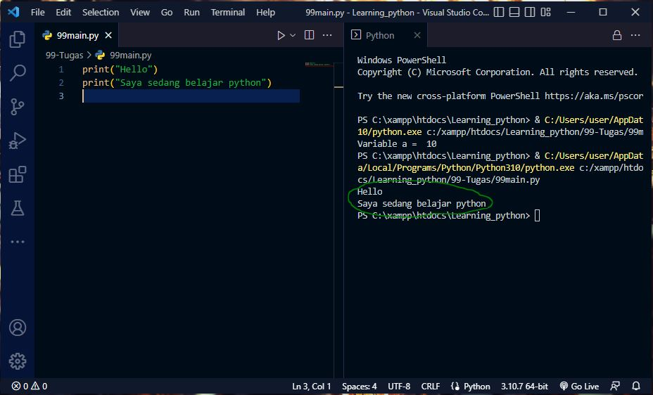
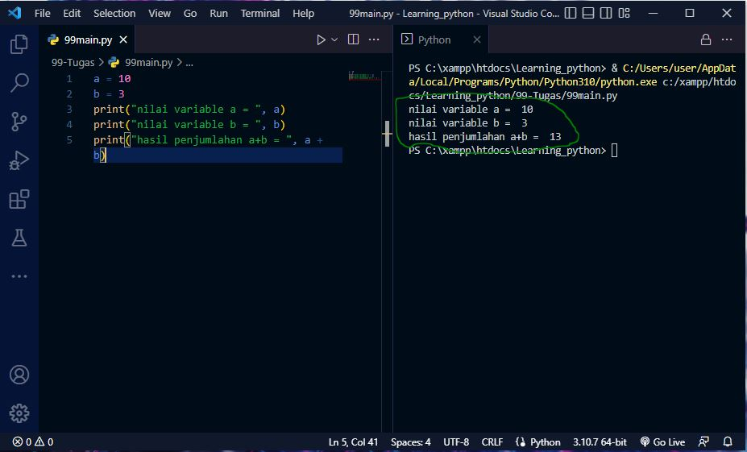
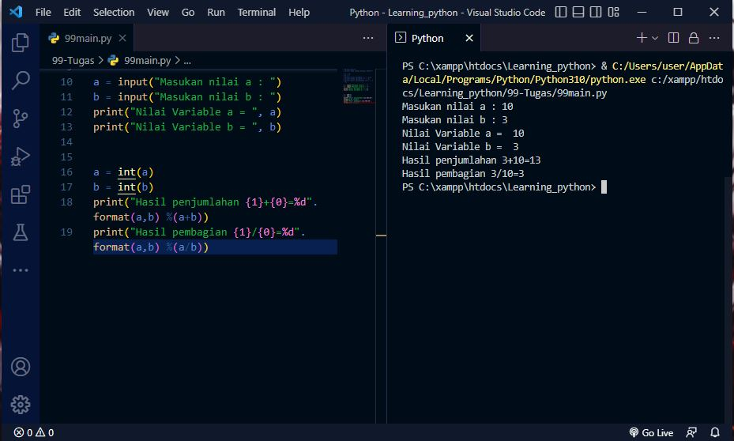

## Tutorial Python Dasar

### 1. Menampilkan tulisan <b style="color: #31eb1c;">"Hello"</b> dan <b style="color: #31eb1c;">"Saya sedang belajar python"</b>.

### 2. Menjumlahkan dua buah bilangan menggunakan Variable "a" dan "b".

### 3. Membuat Variable kembali dan menggunakan method <b style="color: #31eb1c;">input</b> untuk mengambil nilai Variablenya.
